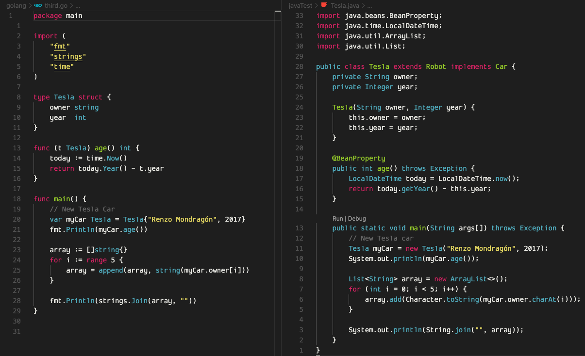
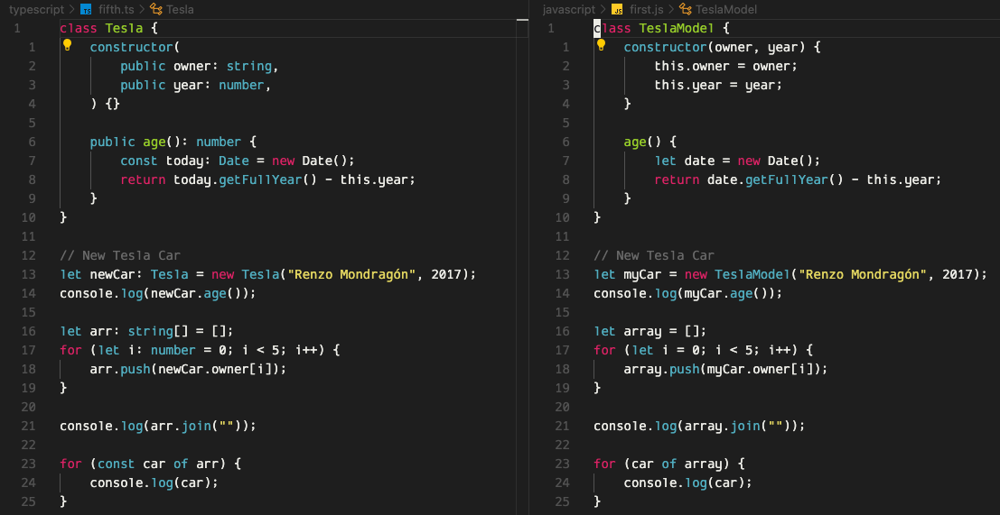
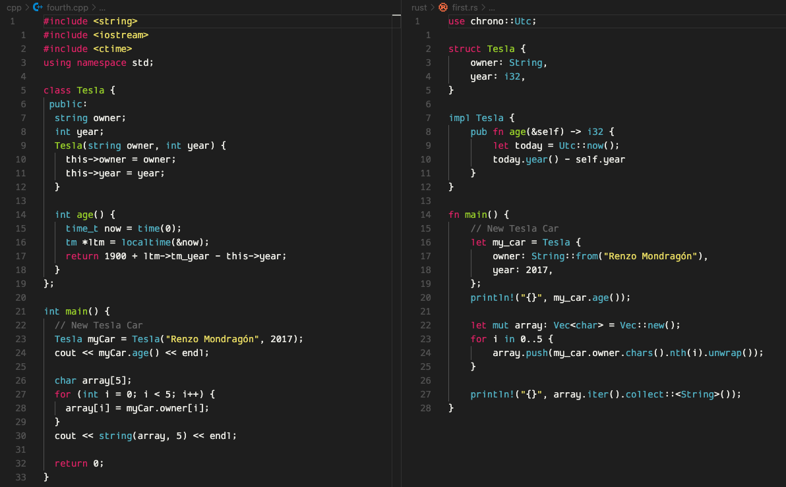
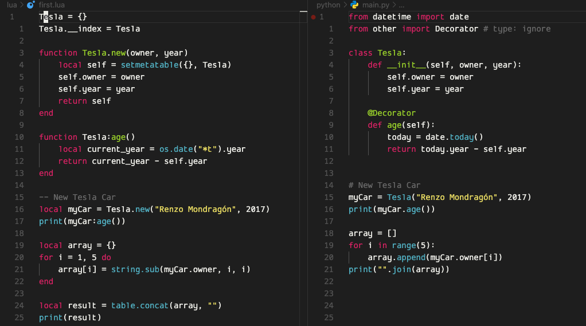

# Google Monokai Theme for VSCode

This is a Visual Studio Code theme that was made inspired on the four colors of Google (blue, red, yellow and green).

This theme focuses on simplicity and concentration. It forces you to keep reading the code and while doing that, your capability of retention increases. It's heavily based on Monokai ST3 by volosovich but removing the extra distracting colors. The editor also has the background colors of Google Colaboratory Dark.

## **Examples!**

### Go/Java:

### Javascript/TypeScript:

### C++/Rust:

### Python/Lua:

